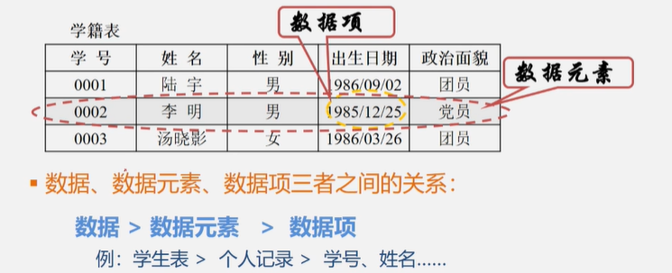
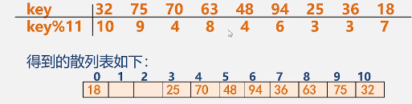
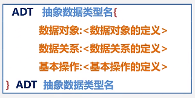
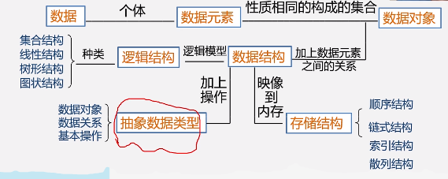
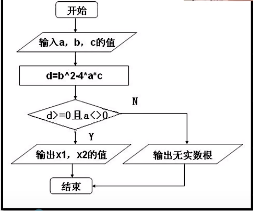
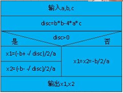
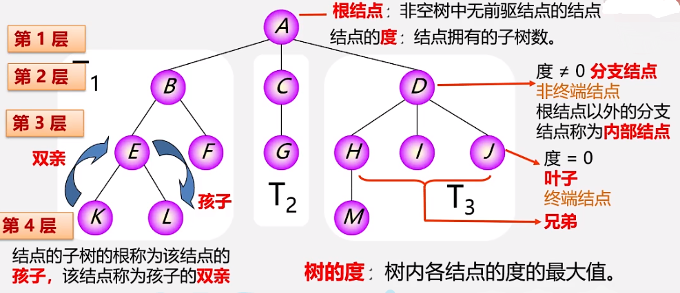
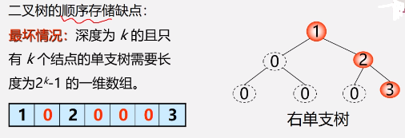
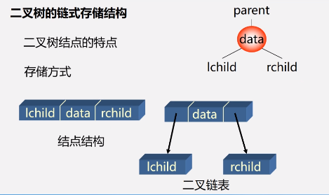

### 数据结构与算法基础
#### 1. 数据(Data)
- 1.1 数据
  - 是能输入计算机且能被计算机处理的各种符号的集合
    - 信息的载体
    - 对客观事物的符号化表示
    - 能够被计算机处理
  - 包括:
    - 数值型数据:整数、实数等
    - 非数值型数据：图片、音频等 
#### 2. 数据元素(Data Element)和数据项
  - 2.1 数据元素
    - 是数据的基本单位,在计算机中，通常作为一个整体进行考虑和处理
    - 也称元素(Element),或称记录、结点或顶点。
    - 一个**数据元素**可由若干个**数据项**组成(Data Item) 
#### 3. 数据项
  - 3.1 勾选数据元素的不可分割的**最小单位**
  - 
#### 4. 数据对象
  - 4.1 是性质相同数据元素的集合，是数据的一个子集
  - 例如：
    - 整数数据对象是集合N={0,±1,±2,...}
    - 字母字符数据对象是集合C={'a','b','c',...}
    - 学籍表也可看作一个数据对象
#### 1.2.2 数据结构
- 数据结构
  - 数据元素不是孤立存在的，它们之间存在某种关系，数据元素相互之间的关系被称为结构
  - 是指相互之间存在一种或多种关系的数据元素的集合
  - 或者说，数据结构是带结构的数据元素的集合
- 数据结构主要包括以下三个方面的内容：
  1. 数据元素之间的逻辑关系，也称为逻辑结构
  2. 数据元素及其关系在计算机内存中的表示(也称为映像)，称为数据的物理结构或数据的存储结构
  3. 数据的运行和实现，即对数据元素可以施加的操作以及这些操作在相应的存储结构上的实现

- 逻辑结构的种类
  - 划分方法一
    1. 线性结构
       - 有且只有一个开始和一个终端节点，并且所有节点都最多只有一个直接前趋和一个直接后继
         - 例如：线性表、栈、队列、串
    2. 非线性结构
       - 一个结点可能有多个直接前驱和直接后继
         - 例如树、图
  - 划分方法二
    1. 集合结构：结构中的元素除了同属于一个集合外，没有其他关系
    2. 线性结构：结构中的数据元素存在一对一的线性关系
    3. 树形结构：结构中的数据元素存在一对多的层次关系
    4. 图状结构(网状结构)：结构中的数据元素存在多对多的任意关系
- 存储结构的种类
  1. 顺序存储结构
     - 用一组连续的存储单元依次存储数据元素，数据元素之间的逻辑关系由元素的存储位置来表示
     - C语言中用数组来实现顺序存储结构
  2. 链式存储结构
     - 用一组任意的存储单元存储数据元素，数据元素之间的逻辑关系用指针来表示
     - C语言中用指针来实现链式存储结构
  3. 索引存储结构
     - 在存储结点信息的同时，还建立附加的索引表
     - 索引表中的每一项称为一个索引项
     - 索引项的一般形式是:(关键字，地址)
     - 关键字是能唯一标识一个结点的那些数据项
     - 若每个结点在索引表中都有一个索引项，则该索引表称之为稠密索引(Dense Index).若一组结点在索引表中只对应一个索引项，则该索引表称之为稀疏索引(Sparse Index)
  4. 散列存储结构
     - 根据结点的关键字直接计算出该结点的存储位置
     
#### 数据类型和抽象数据类型
  - ##### 数据类型
    - 一组性质相同的值的集合以及定义于这个值集合上的一组操作的总称。
    - **数据类型=值的集合+值集合上的一组操作**
    - 在使用高级程序设计语言编写程序时，必须对程序中出现的每个变量、常量或表达式，明确说明它们所属的数据类型
      - 例如，C语言中：
        - 提供了int、char、float、double等基本数据类型
        - 数组、结构、共用体、枚举等构造数据类型
        - 还有指针、空(void)类型
        - 用户也可用typedef自己定义数据类型
    - 一些最基本数据结构可以用数据类型来实现，如数组、字符串等；
    - 而另一些常用的数据结构，如栈、队列、树、图等，不能直接用数据类型来表示。
    -高级语言中的数据类型明显的或隐含的规定了在程序执行期间，变量和表达的所有可能的取值范围，以及在这些数值范围上所允许进行的操作。
      - 例如，C语言中定义变量i为int类型，就表示i是[min,max]范围的整数，在这个整数集上可以进行各种算术运算。
      - 数据类型的作用
        1. 约束变量或常量的取值范围
        2. 约束变量或常量的操作
  - ##### 抽象数据类型(Abstract Data Type,ADT)
    - 是指一个数学模型以及定义在此数学模型上的一组操作。
      - 由用户定义，从问题抽象出数据模型(逻辑结构)
      - 还包括定义在数据模型上的一组抽象运算(相关操作)
      - 不考虑计算机内的具体存储结构与运算的具体实现算法
    - 一个抽象数据类型的定义格式如下：
      - 
      - 其中：数据对象、数据关系的定义用伪代码描述
      - 基本操作的定义格式为：
        - 基本操作名(参数表)
          - 参数表：
            1. 赋值参数 只为操作提供输入值
            2. 引用参数 以&打头，除可提供输入值外，还将返回操作结果
        - 初始条件<初始条件描述>
        - 操作结果<操作结果描述>
  - 小结：
    - 
---
### 1.4 算法与算法分析
- 算法的定义
  - 对特定问题求解方法和步骤的一种描述，它是指令的有限序列。其中每个指令表示一个或多个操作。
- 算法的描述
  - 自然语言：英语、中文
  - 流程图：传统流程图、NS流程图
    -  
  - 伪代码：类语言：
  - 高级语言:
  - 类C语言：
- 算法特性：一个算法必须具备以下五个重要特性
  1. 有穷性
     - 一个算法必须总是在执行有限步骤后结束，且每一步都在有限时间内完成。
  2. 确定性
     - 算法中的每一条指令必须有确切的含义，没有二义性。在任何条件下，只有唯一的一条执行路径，即对于相同的输入只能得到相同的输出。
  3. 可行性
     - 算法是可执行的，算法描述的操作可以通过已经实现的基本操作执行有限次来完成。
  4. 输入
     - 一个算法有零或多个输入。
  5. 输出
     - 一个算法有一个或多个输出。
    
- 算法设计的要求
  - 正确性(Correctness)
    - 算法满足问题要求，能正确解决问题
    - 算法转化为程序要注意：
      1. 程序中不含语法错误
      2. 程序对于几组输入数据能够得出满足要求的结果
      3. 程序对于精心选择的、典型、苛刻且带有刁难性的几组输入数据能够得出满足要求的结果
      4. 程序对于一切合法的输入数据都能得出满足要求的结果。
      通常以第三层意义上的正确性作为衡量一个算法是否合格的标准
  - 可读性(Readability)
    - 算法主要是为了人的阅读和交流，其次才是为计算机执行，因此算法因易于人的理解
    - 另一方面，晦涩难读的算法易隐藏较多错误
  - 健壮性(Robustness)(鲁棒性)
    - 指当输入非法数据时，算法恰当的做出反应或进行相应处理，而不是产生莫名其妙的结果。
    - 处理错误的方法，不应是中断程序的执行，而应是返回一个表示错误或错误性质的值，以便在更高的抽象层次上进行处理
  - 高效性(Efficiency)
    - 要求花费尽量少的时间和尽量少的空间
- 算法效率
  - 时间效率
    - 度量
      - 算法时间效率可以用依据该算法编制的程序在计算机上执行所消耗的时间来度量
      - 两种度量方法
        - 事后统计
          - 将算法实现，测算其时间和空间开销
          - 缺点：编写程序实现算法将花费较多的时间和精力，
        -事前分析
          - 对算法所消耗资源的一种估算方法。
          - 一个算法的运行时间是指一个算法在计算机上运行所消耗的时间大致可以等于计算机执行一种简单的操作所需时间与算法中进行的简单操作次数乘积。
            - 算法运行时间 = 一个简单操作所需的时间 * 简单操作次数
          -即算法中每条语句的执行时间之和
            - 算法运行时间 = Σ每条语句的执行次数 x 该语句执行一次所需时间
            - 每条语句的执行次数 也称为**语句频度**
            - 算法运行时间 = Σ每条语句频度 x 该语句执行一次所需时间
    - 为了便于比较不同算法的时间效率，我们仅比较他们的数量级
      
    - 若某个辅助函数f(n),使得当趋近于无穷大时，T(n)/f(n)的极限值为**不等于零的常数**，
    - 则称f(n)是T(n)的同数量级函数。记作T(n) = O(f(n)),
    - 称O(f(n))为**算法的渐进时间复杂度**(O是数量级的符号)，简称**时间复杂度**。
    - 最坏时间复杂度
      - 在最坏情况下，算法的时间复杂度
    - 平均时间复杂度
      - 在所有可能输入实例在等概率出现的情况下，算法的期望运行时间
    - 最好时间复杂度
      - 在最好的情况下，算法的时间复杂度
    - 对应复杂的算法，可以将它分成几个容易估算的部分，然后利用大O加法法则和乘法法则，计算算法的时间复杂度：
      - 加法法则：
        - T(n) = T1(n) + T2(n) = O(f(n)) + O(g(n)) = O(max(f(n),g(n)))
      - 乘法法则：
        - T(n) = T1(n) * T2(n) = O(f(n)) * O(g(n)) = O(f(n)*g(n))
  - 空间效率
    - 渐进空间复杂度：算法所需存储空间的度量，记作S(n) = O(f(n)),其中n为问题的规模(或大小)
    - 算法要占据的空间
      - 算法本身要占据的空间，输入/输出，指令，常数，变量等
      - 算法要使用的**辅助空间**
  - 时间效率和空间效率有时候是矛盾的。
### 线性表的定义和特点
- 线性表是具有相同特性的数据元素的一个有限序列
  - (a₁,a₂,a₃,a₄...aₙ₋₁,aₙ)

### 5. 树
#### 5. 树和二叉树的定义
 - 树形结构
    - 结点之间有分支
    - 具有层次关系
 - 树的定义
   - 树(Tree)是n(n ≥ 0)个结点的有限集
     - 若n=0，称为空树；
     - 若n>0,则它满足如下两个条件：
       1. 有且仅有一个特定的称为根(Root)的结点  
       2. 其余结点可分为m(m ≥ 0)个互不相交的有限集T₁,T₂,T₃,...,Tₘ,其中每一个集合本身又是一棵树,并称为根的子树(SubTree)
##### 5.1.2 树的基本术语
   - 

##### 5.4 二叉树的性质和存储结构
- 性质1: 在二叉树的第i层至多有2ⁱ⁻¹个结点(i ≥ 1).
- 性质2: 深度为k的二叉树，至多有2ᴷ-1个结点(k ≥ 1)。
- 性质3: 对任何一颗二叉树T,如果其叶子数为n₀,度为2的结点数为n₂,则n₀ = n₂ + 1
- 满二叉树: 一颗深度为k的且有2ᴷ-1个结点的二叉树称为满二叉树
  - 特点: 
    1. 每一层上的结点数都是最大结点数(即每层都满)2ᵏ⁻¹
    2. 叶子结点全部在最底层
- 完全二叉树: 深度为k的具有n个结点的二叉树,当前仅当其每一个结点都与深度为k的满二叉树中编号为1~n的结点一一对应时,称之为完全二叉树。
- 注: 在满二叉树中,从最后一个结点开始,连续去掉任意个结点,即是一颗完全二叉树
  - **一定是连续的去掉!!**
  - 特点: 
    - 叶子只可能分布在层次最大的两层上
    - 对任一结点,如果其右子树的最大层次为i,则其左子树的最大层次为i或i+1
- 性质4: 具有n个结点的完全二叉树的深度为⌊log₂n⌋ + 1
  - 注: ⌊x⌋:称为x的低,表示不大于x的最大整数

- 二叉树的顺序存储缺点:
  
  - 特点:结点间关系蕴含在其存储位置中，浪费空间，适于存满二叉树和完全二叉树

- 二叉树的链式存储结构
   
 

