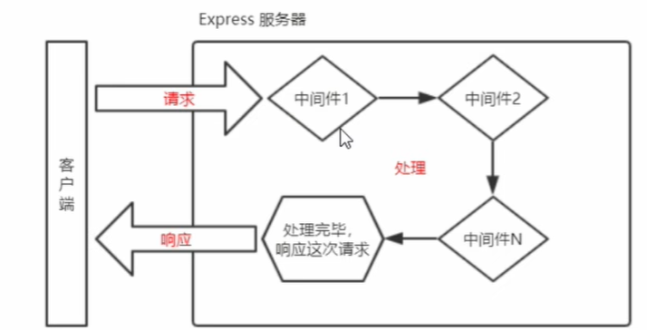
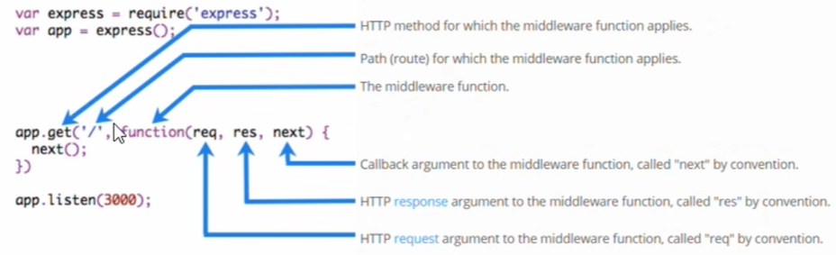

### Express中间件
#### 1. 中间件的概念
- 1.1 什么是中间件
  - 中间件(Middleware),特指业务流程的中间处理环节
- 1.2 现在生活中的例子
  - 在处理污水的时候，一般都要经过三个处理环节，从而保证处理后的废水，达到排放标准
  - 
  - 处理污水的三个中间环节就叫中间件
- 1.3 Express中间件的调用流程
  - 当一个请求到达Express的服务器后，可以连续调用多个中间件,从而对这次请求进行预处理
    -  
- 1.4 Express中间件的格式
  - Express的中间件，本质上就是一个function处理函数，Express中间件的格式如下：
    - 
  - **注意** ==中间件函数形参列表中，必须包含next参数。而路由处理函数中只包含req和res== 
- 1.5 next函数的作用
- next函数是实现中间件连续调用的关键，它表示把流转关系转交给下一个中间件或路由

#### 2. Express中间件的初体验
- 2.1. 定义中间件函数
  - 可以通过以下方式定义一个最简单的中间件函数：
  - ```javascript
        //常量mw就是一个中间件函数
       const mw = function ( req, res, next){
        console.log('excute...')
        //注意：把当前业务处理完毕后，必须调用next()函数把流转关系传递到下一个中间件或路由
        next()      
      }
      
    ```
- 2.2 全局生效的中间件
  - 客户端发起的任何请求，到达服务器之后，都会触发的中间件，叫做全局生效的中间件。
    - 通过调用app.use(中间件函数)，即可定义一个全局生效的中间件，示例代码如下：
    - ```javascript
        const express = require('express');
      
        const mw = function ( req, res, next){
        console.log('excute...')
            //注意：把当前业务处理完毕后，必须调用next()函数把流转关系传递到下一个中间件或路由
            next()      
        };
        //常量
        express.use(mw);
        express.listen(8080,() => {
          console.log('server started...')
        })
      ```
- 2.3
- 2.4 中间件的作用
  - 多个中间件之间，共享同一份req和res.基于这样的特性，我们可以在上游的中间件中，统一为req和res对象添加自定义的属性或方法，供下游的中间件或路由器使用。
  
- 2.5 定义多个全局中间件
  - 可以使用app.use()连续定义多个全局中间件。客户端请求到达服务器之后，会按照中间件定义的先后顺序依次进行调用，示例代码如下：
  - ```javascript
      const express = require('express');
      const app = new express();
      app.use(( req, res, next) => {
        console.log('全局中间件一')
        next()    
      })
      
      app.use(( req, res, next) => {
        console.log('全局中间件二')
        next()    
      })    
      
      app.get('/',(req, res) => {
        res.send('s')
      })
      app.listen(8080,() => {
        console.log('started...')
      })
    ```